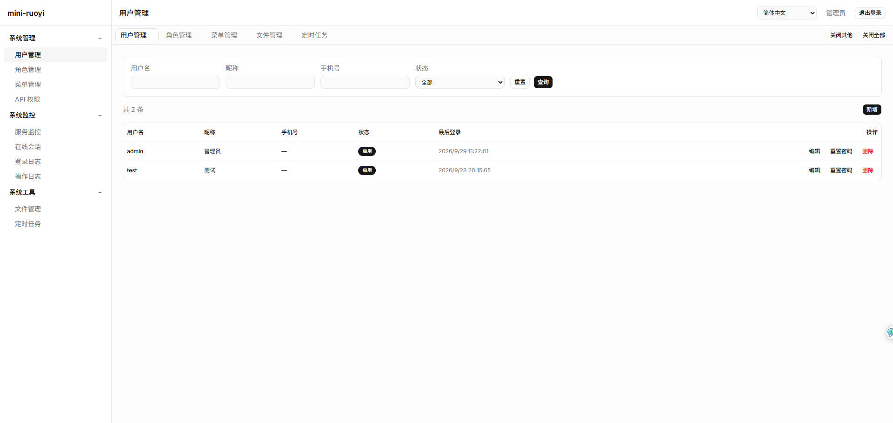
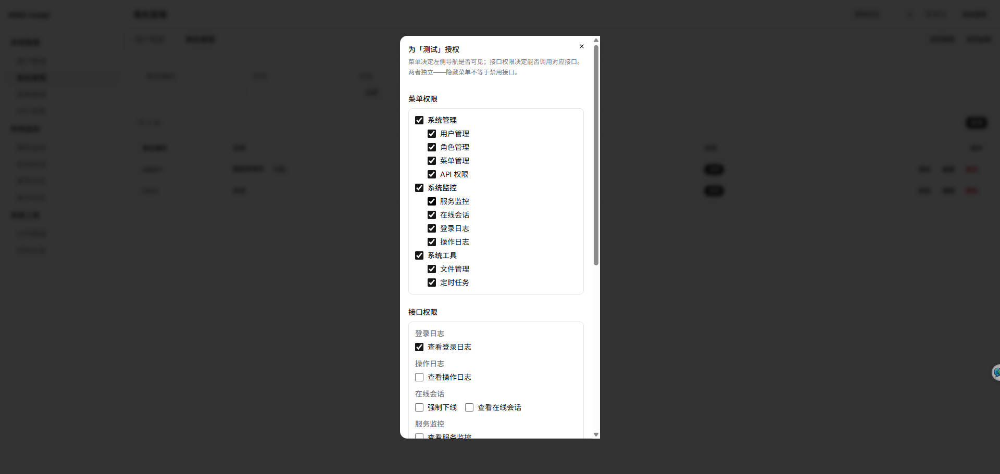
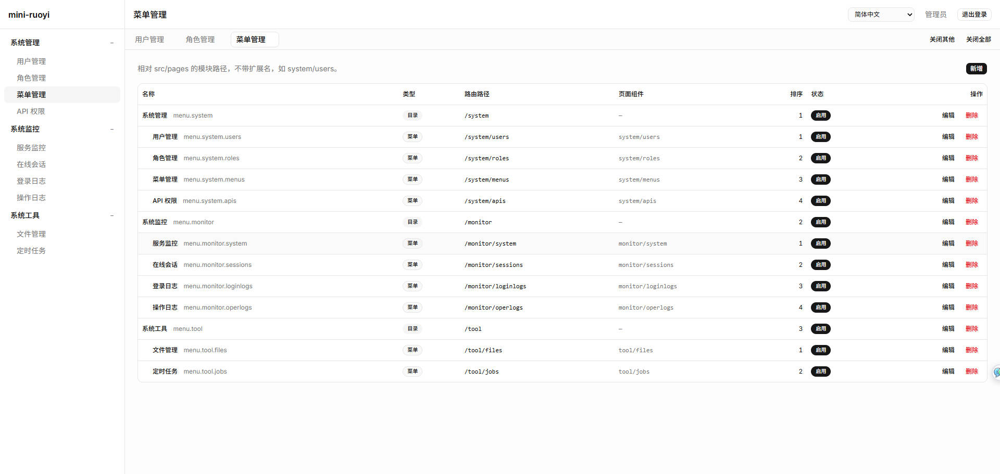
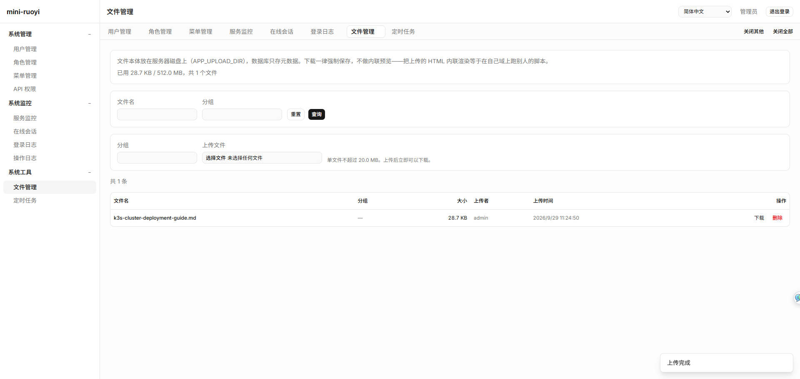
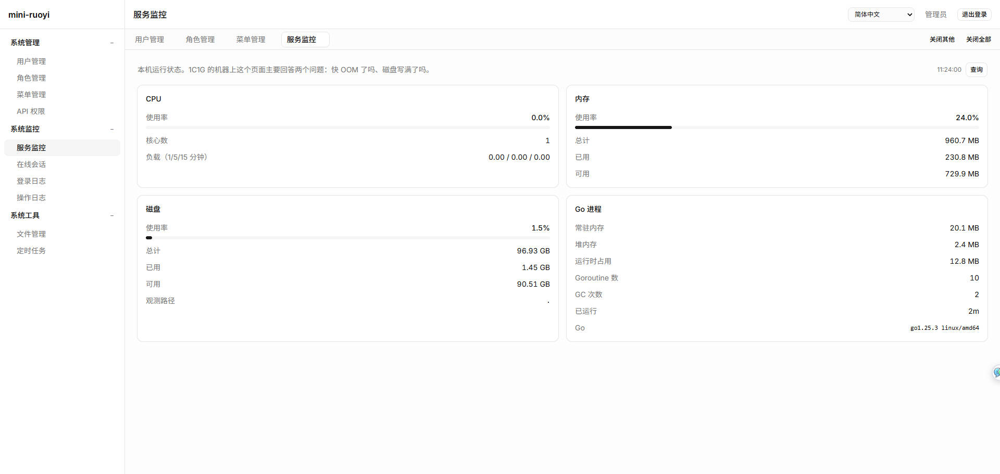
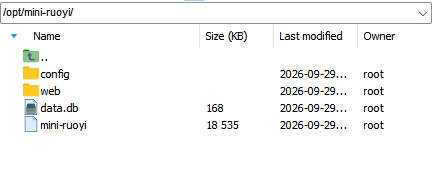
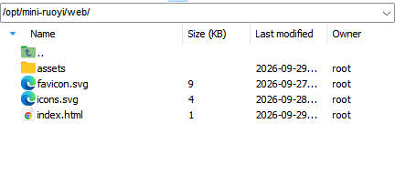
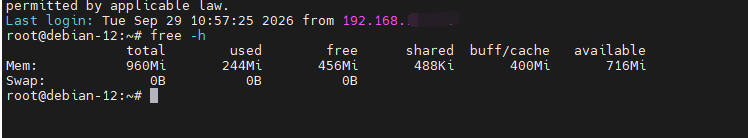
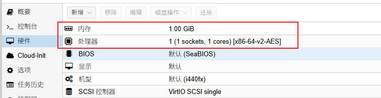

# mini-ruoyi

English | [简体中文](README.zh-CN.md)

A minimal admin system that runs on a 1-core, 1 GB server. The backend is a single Go process (Gin + SQLite), the
frontend is a Svelte 5 single-page app, and **the backend serves the frontend build straight off disk** — so
deployment needs no nginx, the runtime needs no Node, and there is no separate database service to run.

## Features

- **One binary + one frontend directory**: `bin/mini-ruoyi` and `bin/web/`. `scp` them up and start; a single systemd unit is all it takes
- **The frontend updates on its own**: the build output is not embedded in the binary, so rebuilding needs no backend restart — a browser refresh picks up the new version
- **Zero CGO**: SQLite comes from `modernc.org/sqlite` (pure Go), so `GOOS/GOARCH` cross-compilation works without any setup
- **No ORM**: `database/sql` plus hand-written SQL that stays readable and tunable
- **Versioned migrations**: `migrations/*.sql` run in numeric order at startup, with applied files skipped via the `schema_migrations` table
- **A language-neutral API**: the backend only ever emits stable i18n keys; the frontend renders them as `zh-CN` / `en-US`
- **Frontend i18n**: hand-written, about 130 lines, zero runtime dependencies, and a missing dictionary key fails the build
- **Built for low-spec machines**: 20 rps per-IP rate limit (burst 40), 1 MiB request body cap, SQLite connection pool capped at 4, WAL + `synchronous=NORMAL`
- **Fail-closed permissions**: a business endpoint cannot be registered without declaring a permission code (otherwise startup panics),
  an unauthenticated request is always 401 and a missing permission always 403, and the set of public endpoints is pinned by a test

## Screenshots

|  |  |
| --- | --- |
|  |  |
|  |  |
|  |  |

## Quick start

Requires Go 1.25+ and Node.js 20+ (Node is only used to build the frontend).

```bash
git clone <repo-url> && cd mini-ruoyi
make build     # build the frontend into web/dist, compile the binary into bin/, then place the frontend at bin/web/
make run       # start it; listens on :8080 by default
```

Open <http://localhost:8080>.

Backend API only:

```bash
make dev-server            # go run; falls back to API-only mode when the web/ directory is missing
curl localhost:8080/healthz
```

Split development (hot-reloading frontend + backend API):

```bash
make dev-server            # terminal 1: backend on :8080
make dev-web               # terminal 2: Vite dev server on :5173, proxying /api and /healthz to :8080
```

## Deployment

```
/opt/mini-ruoyi/
├── mini-ruoyi          # the binary
├── web/                # frontend build output (index.html + assets/)
└── data.db             # SQLite database; created on first start, or use the bundled initial database
```

This is what it actually looks like on a server — the binary, the frontend directory, the database and the upload
directory all sit in one folder:



The frontend directory is just an `index.html` plus content-hashed `assets/`:



Both the systemd unit and the nginx config live in this repository and can be used as-is:

```bash
sudo cp deploy/mini-ruoyi.service /etc/systemd/system/
```

The unit already sets `GOMEMLIMIT=700MiB` / `GOGC=50` / `GOMAXPROCS=1` —
**do not remove them**, or the GC will climb until it hits the machine's limit and the OOM killer takes the process down,
which shows up as "the process randomly restarts".

Actual memory usage on a test server:



Full deployment, backup, upgrade and troubleshooting instructions are in [docs/deployment.en.md](docs/deployment.en.md).

The frontend directory is searched in this order, taking the first one that contains an `index.html`:

1. `web/` next to the binary (the deployed layout)
2. `./web` (when the working directory is the repository root)
3. `../bin/web`, `bin/web` (**the usual case when starting from an IDE or `go run`**)

You can also set it explicitly with `APP_WEB_DIR`.

> ⚠️ **When running `cmd/server` straight from GoLand / VS Code**: the binary sits in a temp directory and the working
> directory is `server/`. Early versions only looked next to the binary, failed to find the frontend, and then
> **silently fell back to API-only mode** — you would open :8080 and see `{"code":404,"msg":"error.notFound"}`.
> That now resolves through `../bin/web`; if it still misses, the log tells you to run `make build` or set `APP_WEB_DIR`.

**Updating the frontend does not require a backend restart**: run `make web` again, sync the contents of `dist/` to the
server's `web/` directory, and users get the new version on refresh.
(`index.html` is served `no-cache` while `assets/*` are `immutable` with content-hashed filenames — the two together are what makes refresh-gets-the-latest work.)

## Deployment shapes

The frontend is a plain static directory, so anything can serve it. The backend **falls back to API-only mode** when `web/`
does not exist, which means all three of "Go serves it directly", "Vite for local development" and "nginx serves the
frontend" work — the latter two just need extra configuration. See [docs/architecture.en.md](docs/architecture.en.md) §5.1.

## Configuration

**Config file + environment variables**, with the precedence **environment variables > config file > built-in defaults**.
Environment variables win so that systemd / containers can override a single value without touching the file.
**It runs without a config file** — every setting has a default.

```bash
cp server/config/config.example.yaml server/config/config.yaml   # edit as needed; optional
```

`config.yaml` is in `.gitignore` (it carries deployment specifics such as the listen address and proxy addresses);
the committable sample is `server/config/config.example.yaml`.

```yaml
server:
  addr: ":8080"
  env: prod                          # dev enables gin debug mode
  secure_cookie: false               # must be true when a TLS terminator sits in front
  trusted_proxies: []                # must list the proxy addresses when nginx is in front
  rate_limit: { rps: 20, burst: 40 } # per IP

database:
  path: data.db                      # relative to the process working directory

web:
  dir: ""                            # empty = locate the frontend build output automatically

upload:
  dir: uploads
  max_mb: 20                         # per-file limit
  quota_mb: 512                      # total capacity limit, must not be smaller than max_mb

log:
  retention_days: 30                 # retention for operation and login logs
```

**Bad configuration refuses to start** and points at the exact place, rather than silently falling back to a default
(the binary prints its own messages in Chinese):

```
加载配置: 解析配置文件 config/config.yaml: field max_size not found in type config.Upload
加载配置: 环境变量取值非法: APP_UPLOAD_MAX_MB="二十"
加载配置: upload.quota_mb（10）不能小于 upload.max_mb（100），否则一个文件都传不上去
```

At startup it prints a one-line summary of the effective configuration (every path is absolute, so "where is the data"
and "where do uploads go" are visible at a glance):

```
监听 :8080（prod）| 数据库 /opt/mr/data.db | 前端 /opt/mr/web | 上传 /opt/mr/uploads
（单文件 20 MiB / 共 512 MiB）| 日志保留 30 天 | 可信代理 127.0.0.1
```

Configuration on a test server:



### Environment variables

All optional; each overrides the config-file setting of the same name.

| Variable | Default | Config setting |
| --- | --- | --- |
| `APP_CONFIG` | `config/config.yaml` | the config file path itself |
| `APP_ADDR` | `:8080` | `server.addr` |
| `APP_ENV` | `prod` | `server.env` (`dev` enables gin debug mode) |
| `APP_SECURE_COOKIE` | `false` | `server.secure_cookie` |
| `APP_TRUSTED_PROXIES` | empty (no proxy is trusted) | `server.trusted_proxies` (comma-separated) |
| `APP_RATE_LIMIT_RPS` | `20` | `server.rate_limit.rps` |
| `APP_RATE_LIMIT_BURST` | `40` | `server.rate_limit.burst` |
| `APP_DB_PATH` | `data.db` | `database.path` |
| `APP_WEB_DIR` | auto-detected | `web.dir` |
| `APP_UPLOAD_DIR` | `uploads` | `upload.dir` |
| `APP_UPLOAD_MAX_MB` | `20` | `upload.max_mb` |
| `APP_UPLOAD_QUOTA_MB` | `512` | `upload.quota_mb` |
| `APP_LOG_RETENTION_DAYS` | `30` | `log.retention_days` |
| `GOMEMLIMIT` | none | Go heap soft limit; `700MiB` is recommended on a 1 GB machine |

## Repository layout

```
mini-ruoyi/
├── Makefile                    # build entry point
├── docs/                       # architecture docs
├── server/                     # Go backend (where go.mod lives; module name mini-ruoyi)
│   ├── cmd/server/main.go      # startup, dependency wiring, graceful shutdown
│   ├── internal/               # see docs/architecture-server.en.md
│   └── data.db                 # the bundled initial database (works out of the box)
└── web/                        # Svelte 5 frontend
    ├── src/                    # see docs/architecture-web.en.md
    └── dist/                   # build output (not committed; served by the backend)
```

## Common commands

```
make help        list every command
make check       pre-commit gate: gofmt + go vet + cross-compilation + backend tests + frontend type check
make test        backend tests (forced -count=1; see docs/architecture-server.en.md for why)
make test-e2e    browser tests (builds first, then starts a backend on a temporary database)
make deps        install frontend dependencies
make web         build the frontend into web/dist
make build       build the binary + frontend output into bin/
make run         build, then start
make dev-server  start the backend (go run)
make dev-web     start the Vite dev server
make clean       remove bin/ and web/dist
make db-clean    strip dev data from server/data.db — run before committing (see below)
```

⚠️ **`server/data.db` is both the shipped seed database and the live development database.** Start the backend from
`server/` and log in once, and sessions plus logs are written into it — they get committed along with everything else,
which shows up as "I cloned this and the online-sessions page lists someone else's records". Run `make db-clean`
before committing. (It needs the `sqlite3` CLI; running the project itself does not.)

## Documentation

| Document | Contents |
| --- | --- |
| [docs/schema.en.md](docs/schema.en.md) | **Database schema**: tables and fields, DDL, permission model, decision log for field choices |
| [docs/deployment.en.md](docs/deployment.en.md) | **Deployment and operations**: systemd, nginx, backup/restore, upgrades, troubleshooting |
| [docs/architecture.en.md](docs/architecture.en.md) | Overall architecture: process model, frontend/backend contract, key decisions and trade-offs |
| [docs/architecture-server.en.md](docs/architecture-server.en.md) | Backend architecture: layering, middleware chain, response contract, data layer, migrations |
| [docs/architecture-web.en.md](docs/architecture-web.en.md) | Frontend architecture: reactivity, i18n, how it integrates with the backend |
| [server/README.en.md](server/README.en.md) | Backend project notes: API list, tests, how to add a migration |
| [web/README.en.md](web/README.en.md) | Frontend project notes: development workflow, how to add copy and components |

## Status

**Implemented**: the layered skeleton, the unified response contract, SQLite connection and migrations, static asset
hosting, per-IP rate limiting, the frontend toolchain and i18n.

**Backend complete**: authentication (session + CSRF), RBAC authorization (34 permission-protected endpoints, with
permission codes declared in code and validated at startup), full CRUD for users / roles / menus / permission codes,
delete confirmation and guards, and versioned migrations.
The table definitions are in [docs/schema.en.md](docs/schema.en.md) and the endpoints in [server/README.en.md](server/README.en.md).

It also includes **system monitoring** (force-logout of online sessions, login logs, operation logs) and **system tools**
(file management, scheduled jobs). Log retention defaults to 30 days and is configurable; uploads are capped both
per file and in total.

**Not implemented yet**:

- **State persistence** for multiple tabs (a refresh keeps only the current tab)
- List export (CSV / Excel)
- Login failure lockout

See the to-do list in [docs/architecture.en.md](docs/architecture.en.md).

## License

[MIT](LICENSE)